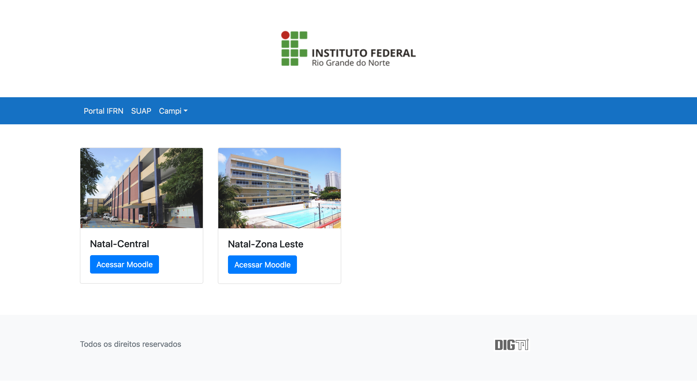
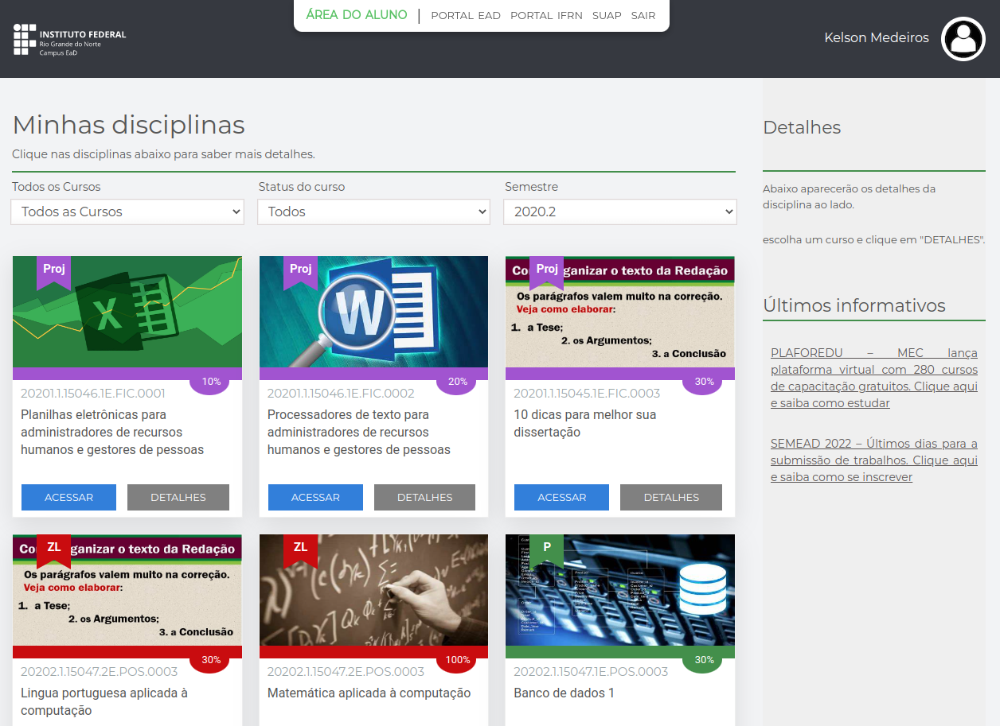
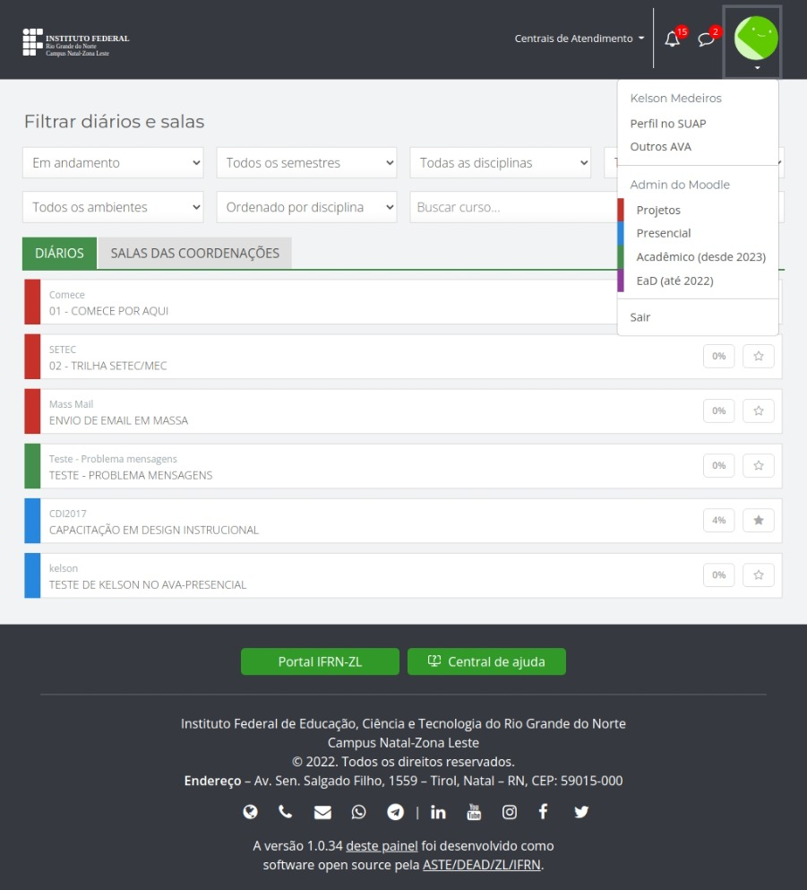
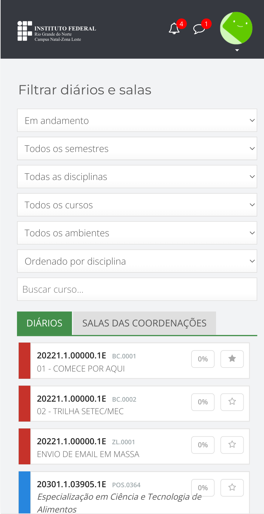
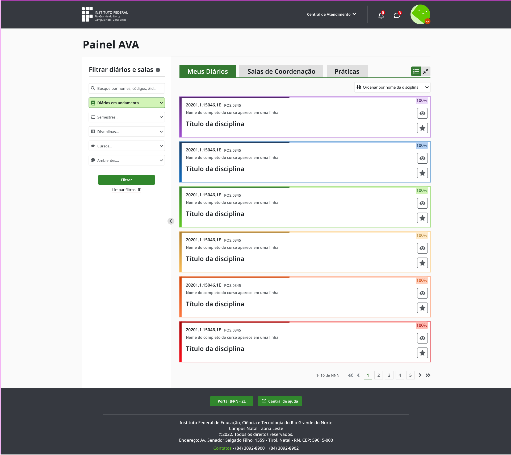
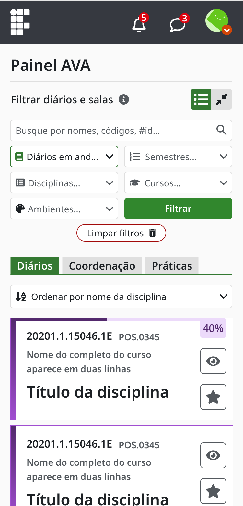
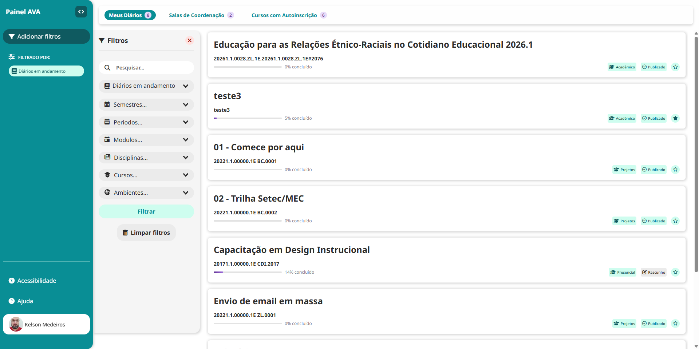
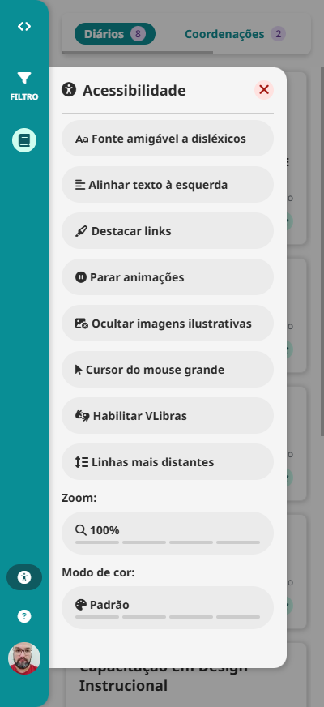
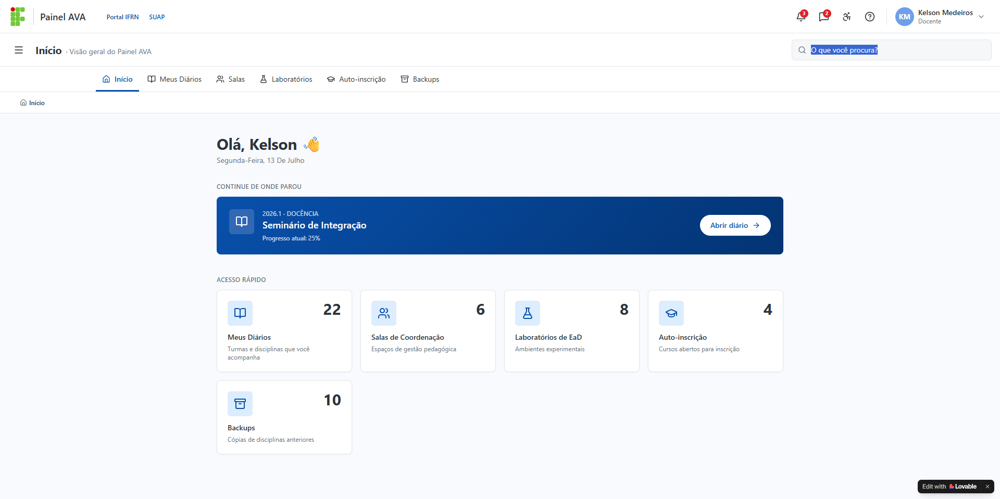
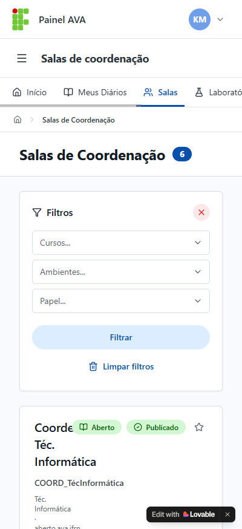

# Evolução do design do Painel AVA

## v1 - Esforço urgente, sem projeto de UX
Criado durante a pandemia.
### v1 Desktop

## v2 - Hiper focado no aluno
### v2 Desktop

## v3 - Uso comum por aluno, tutor e professor
### v3 Desktop

### v3 Mobile

## v4 - Melhorias na UX
### v4 Desktop

### v4 Mobile

### v5 - Simplificação da UX (versão corrente)
### v5 Desktop

### v5 Mobile

## v6 - Novos recursos (alpha)
### v6 Desktop

### v6 Mobile

